# Desafio Convenia

<!--  -->

Este é um desafio proposto pela Convenia, com a finalidade de retirar insights de uma base de dados disponibilizada

## Base de Dados

A base de dados são duas planilhas:
>- celularessubtraidos_2024_1_6_(1)
>- celularessubtraidos_2024_7_9_(1)

Temos também a planilha *dicionario_bd_(1)* que explica melhor sobre as bases de dados, quais informações temos o que cada campo significa.

<br>

Com as bases disponibilizadas, utilizei o Python para poder realizar o primeiro tratamento de dados
___
### Python
Primeiramente, importei a biblioteca *Pandas* que será necessária para realizar a importação das planilhas e realizar os tratamentos dos dados.

````
import pandas as pd
````

Após a importação do *Pandas*, importei a primeira planilha e utilizei a função info() para poder verificar melhor os dados dessa primeira planilha, como nome das colunas, tipo de dados e quantos dados não nulos existentes:

````
celulares_subtraidos1 = pd.read_excel('celularessubtraidos_2024_1_6_(1).xlsb')
````

````
celulares_subtraidos1.info()
````

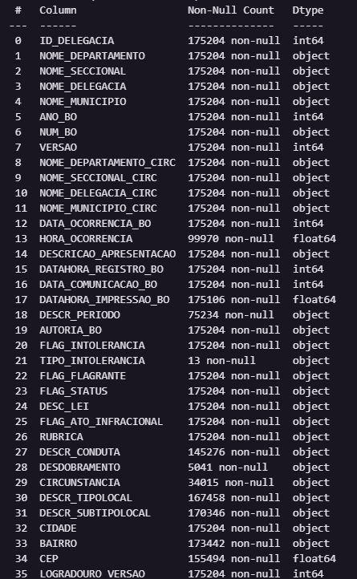

Fiz o mesmo processo com a segunda planilha

````
celulares_subtraidos2 = pd.read_excel('celularessubtraidos_2024_7_9_(1).xlsb')
````

````
celulares_subtraidos2.info()
````

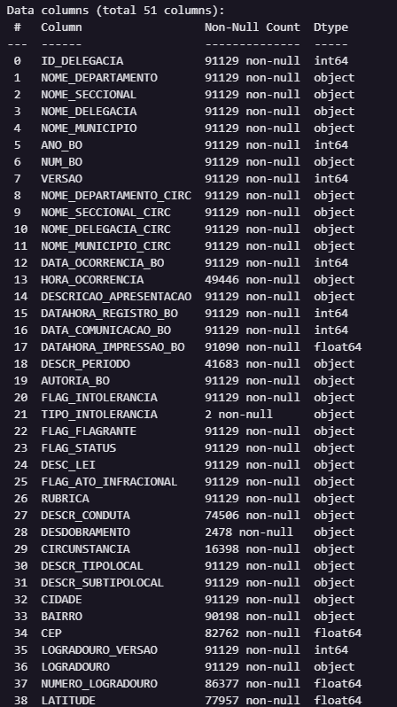

Após o processo de importação das planilhas, realizei a união das duas planilhas, pois, as duas possuem a mesma estrutura de dados (mesma quantidade de colunas com o mesmo nome).

````
df = pd.concat([celulares_subtraidos1, celulares_subtraidos2])
````

Agora temos um DataFrame com o nome de *df* que possui os dados das duas planilhas juntas.

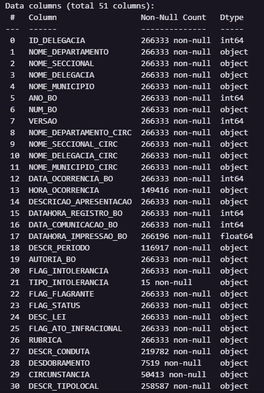

Algumas colunas apresentam valores nulos com tipo *object*. Para esses casos, irei utilizar a função *unique()* para poder visualizar os valores distintos em determinadas colunas.

Neste caso, irei realizar o mesmo processo abaixo nas colunas:
>- DESDOBRAMENTO
>- TIPO_INTOLERANCIA
>- DESCR_CONDUTA
>- DESCR_UNIDADE
>- CIRCUNSTANCIA
>- DESCR_TIPOLOCAL
>- DESCR_SUBTIPOLOCAL
>- FLAG_BLOQUEIO
>- FLAG_DESBLOQUEIO
>- DESCR_PERIODO

As demais colunas de Data, Hora ou Número, serão tratadas no Power BI.

````
df['TIPO_INTOLERANCIA'].unique()
````

No caso da coluna TIPO_INTOLERANCIA, temos os seguintes valores abaixo:

````
array([nan, 'Homofobia/Transfobia', 'Racial/Etnia/Cor'], dtype=object)
````

Como podemos visualizar, temos o valor *nan* que seriam os valores nulos, juntamento com outros dois valores preenchidos.

Para poder tratar os valores nulos, iremos utilizar a função *fillna()* que realizar o tratamento de todos os valores nulos dentro de determinado campo. No caso, iremos preencher dentro dessa função o valor *Não Informado* para que os valores nulos sejam alterados para esse valor.

````
df['TIPO_INTOLERANCIA'] = df['TIPO_INTOLERANCIA'].fillna('Não Informado')
````

Validando novamente a coluna, podemos verificar que todos os valores não nulos foram preenchidos, ficando da seguinte forma:

**Antes**: 
<br>


**Depois** 
<br>


Finalizado o processo de tratamento dos dados, iremos exportar os dados para um arquivo *celulares_subtraidos_consolidado* no qual iremos carregar no Power BI, finalizar o tratamento dos dados e realizar a construção dos painéis.


````
df.to_excel('celulares_subtraidos_consolidado.xlsx')
````


## Power BI
Após a extração da planilha, iremos subir o aquivo no Power BI para ser tratado no Power Query.

Iremos chamar essa base de *Base de Dados*.

Primeiramente, ocorre o processo padrão utilizar a primeira linha como cabeçalho da coluna e também iremos identificar o tipo da coluna de forma automática:

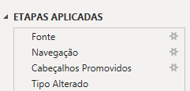

Após esse processo, iremos retirar as duplicatas da base de dados.

As duplicatas, conforme informado dentro da planilha que explica sobre a base de dados, devem ser removidas utilizando 3 colunas:

>- NOME_DELEGACIA
>- ANO_BO
>- NUM_BO

<br>

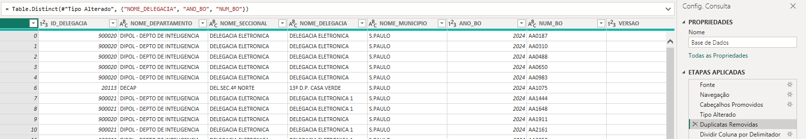

A coluna HORA_OCORRENCIA possui um caso específico. Algumas linhas, após a identificação da hora exata preenchida, possui um campo *.0000000* após a hora, que ocorre um erro quando a coluna é convertida para hora.

Para solucionar esse caso, iremos dividir a coluna utilizando o delimitador ponto *"."* para separarmos esses valores.

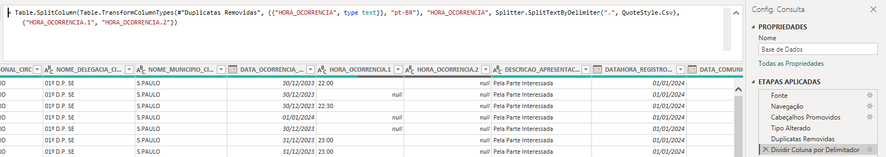

Por padrão, o Power Query transformou essas colunas para o tipo texto. Basta retomar a primeira coluna que contém a hora para o formato de *tempo*, renomear a coluna de volta para HORA_OCORRENCIA e apagar a segunda coluna criada.

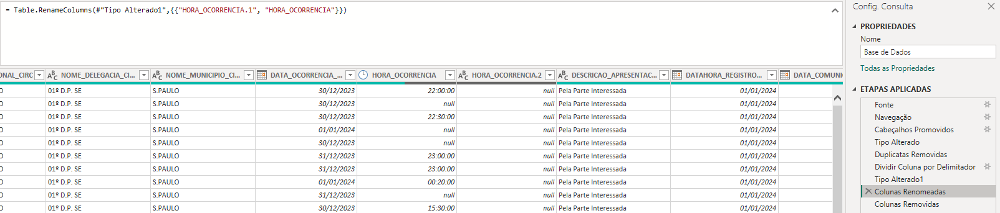

No próximo passo, iremos remover as seguintes colunas que não irão fazer parte da nossa análise. Alguns campos serão removidos por motivos de não fazerem sentido para o nosso tipo de análise, outros porque o campo possui somente 1 valor preenchido:

>- Column1 
>- MES
>- ANO
>- LONGITUDE
>- LATITUDE
>- CEP
>- LOGRADOURO_VERSAO
>- LOGRADOURO
>- NUMERO_LOGRADOURO
>- CONT_OBJETO
>- DESCR_MODO_OBJETO
>- DESCR_TIPO_OBJETO
>- DESCR_SUBTIPO_OBJETO
>- DESCR_UNIDADE
>- HORA_OCORRENCIA.2
>- VERSAO
>- DATAHORA_REGISTRO_BO
>- DATA_COMUNICACAO_BO
>- DATAHORA_IMPRESSAO_BO
>- FLAG_STATUS

<br>

Ao analisarmos mais a fundo os dados, podemos perceber que as colunas HORA_OCORRENCIA e DESCR_PERIODO possuem algumas divergências. A coluna DESCR_PERIODO quando está marcada como "Não Informado", a coluna HORA_OCORRENCIA está preenchida com o horário do registro do BO, enquanto quando a coluna de hora está em branco, a coluna de descrição do período está preenchido.

Para ajustar esses dados, iremos criar uma coluna condicional com o nome de *Periodo da Ocorrencia", no qual iremos criar uma condicional a partir da coluna das horas para ficar de acordo com a coluna DESCR_PERIODO.

````
if Time.From([HORA_OCORRENCIA]) = null then [DESCR_PERIODO]
else if Time.From([HORA_OCORRENCIA]) < #time(6,0,0) then "De madrugada"
else if Time.From([HORA_OCORRENCIA]) < #time(12,0,0) then "Pela manhã"
else if Time.From([HORA_OCORRENCIA]) < #time(18,0,0) then "A tarde"
else if Time.From([HORA_OCORRENCIA]) < #time(23,59,59) then "A noite"
else [DESCR_PERIODO]
````

Basicamente, o código acima irá verificar se a coluna do horário não está preenchido. Se caso não estiver, ele irá preencher de acordo com a coluna do periodo, mas se caso tiver preenchido, iremos tratar da seguinte forma:

>- 00:00 -> 05:59 = "De madrugada"
>- 06:00 -> 11:59 = "Pela manhã"
>- 12:00 -> 17:59 = "A tarde"
>- 18:00 -> 23:59 = "A noite"

Dessa forma, conseguiremos fazer uma análise dos períodos.

Posteriormente, criei a coluna condicional "Ordem do Periodo da Ocorrência" que iremos utilizar para ordenar os períodos nos gráficos dentro do Power BI.

As colunas ficaram com o tipo de Texto e Número Inteiro, respectivamente.

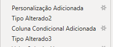

Posteriormente, iremos tratar as seguintes colunas para termos os valores de acordo com a documentação oficial:

>- AUTORIA_BO - D para Desconhecida e C para Conhecida
>- FLAG_INTOLERANCIA - N para Não e S para Sim
>- FLAG_FLAGRANTE - N para Não e S para Sim
>- FLAG_ATO_INFRACIONAL - N para Não e S para Sim

<br>


Após essas mudanças, iremos alterar dois valores na coluna QUANTIDADE_OBJETO. Temos dois valores que provavelmente foram inseridos de forma errada pois fogem completamente do restante dos números.

Os números são o 1111111 e o 1351989, que iremos alterar para quantidade 1 para podermos aproveitar o BO registrado.

A última alteração que iremos realizar, será o nome S. PAULO para SÃO PAULO na coluna CIDADE, pois dessa forma fica mais fácil a leitura e mais fácil de filtrar a cidade a depender da análise.

Para finalizarmos, iremos criar mais dois campos personalizados, chamados de Dia da Semana e Dia da Semana - Ordem.

Dia da semana será para podermos validar qual dia da semana que o BO foi registrado e a ordem será para podermos ordenar de acordo com o dia da semana, iniciando no domingo.

````
Date.DayOfWeekName([DATA_OCORRENCIA_BO], "pt-BR")
````
````
Date.DayOfWeek([DATA_OCORRENCIA_BO], Day.Sunday)
````

<br>


# Insights

Agora iremos mostrar alguns insights que podemos obter com os painéis criados.

*Obs: Iremos utilizar o período do dia 01/01/2024 ao dia 30/09/2024, período onde tivemos maior volume de registros.*

O primeiro painel abaixo, ficou da seguinte forma:

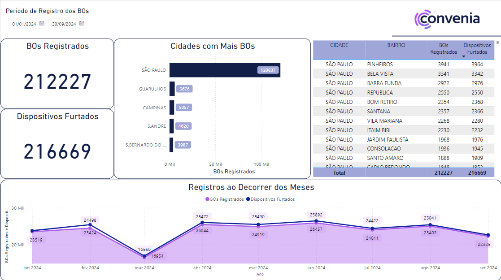

Nesse painel, podemos visualizar a quantidade de BOs que tivemos registrados no determinado período, juntamente com a quantidade de Dispositivos Furtados.

Podemos ver que a cidade de São Paulo é a cidade com mais BOs registrados. Cerca de 56% do registros que possuímos na nossa base de dados.

A direita, conseguimos ver visualizar os bairros onde temos mais BOs registrados e/ou dispositivos roubados. O bairros onde se encontram com mais BOs registrados, são os bairros onde temos um alto número de concentração de pessoas e possivelmente turistas, pois possuímos pontos de passeio e pontos turísticos nessa região.

O último gráfico apresenta uma envolução dos registros de BOs e dispositivos furtados. No mês de março tivemos uma quebra brusca do padrão dos dados. Esse fato pode se dar realmente por pouco roubo de dispositivo, ou por perca dos dados na hora da extração da informação.

Podemos visualizar que de Janeiro até Abril tivemos uma cresce no númerpo de BOs registrados, que se manteve um pouco no padrão até o mês de Junho, no qual começou a ter uma leve queda até o mês de Setembro.

Hoje existem fontes na internet que informam que o índice de criminalidade em São Paulo caiu bastante em 2024 ao decorrer do ano, e também se comparado a anos anteriores.

___
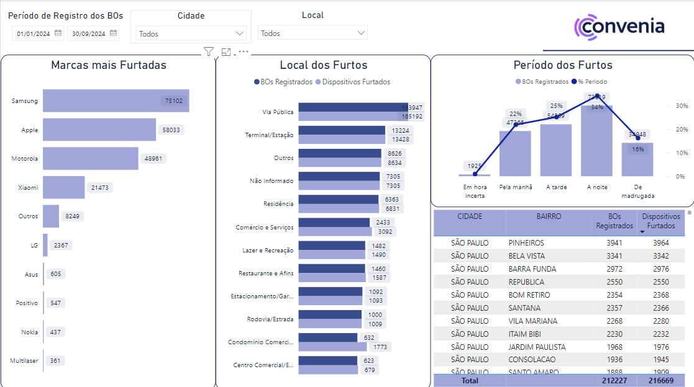

Nesse painel, podemos ter mais detalhes sobre os BOs.

Conseguimos ver um rankeamento das marcas que foram mais furtadas. Podemos ver que as 3 primeiras são as marcas que são mais vendidas hoje no mercado brasileiro, cerca de 82% dos furtos.

O segundo gráfico podemos ver o tipo de local onde ocorreram mais furtos. Há também uma comparação com a quantidade de dispositivos roubados relacionados a cada localização. na vias públicas ou lugares públicos, podemos ver que temos quase a média de 1 pra 1 em relação a dispositivos roubados com a quantidade de BOs. Exceto lugares com comércio, como lojas e shoppings, onde a o número de dispositivos sobe um pouco mais em relação aos outros, que se dá por conta de roubo em alta quantidade de dispositivos.

Podemos ver também os furtos por períodos do dia. Cerca de 60% dos furtos são realizados na parte da tarde ou noite, onde se tem uma grande concentração de pessoas nas ruas, seja para fins pessoais em visitar algum local, ou seja para retornar do trabalho.

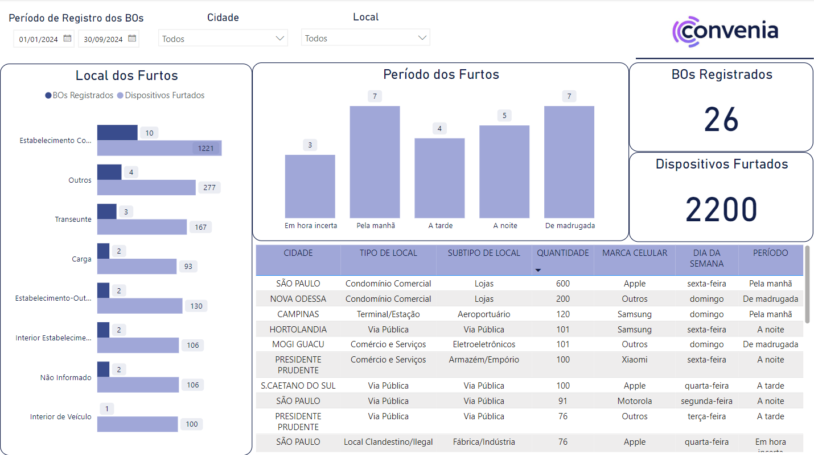

Nesse painel, mostra os BOs registrados no qual a quantidade de celulares furtados é 30 ou mais.

Podemos constatar que os furtos em grandes quantidades foram realizados em estabelecimentos comerciais. E esses furtos foram realizados em grande parte na madrugada e na parte da manhã, muito devido ao horário em que o BO foi registrado.

Na listagem na parte inferior, podemos verificar melhor sobre esses BOs, como onde foi realizado, quantidade e qual a marca de telefone que foi mais roubada.

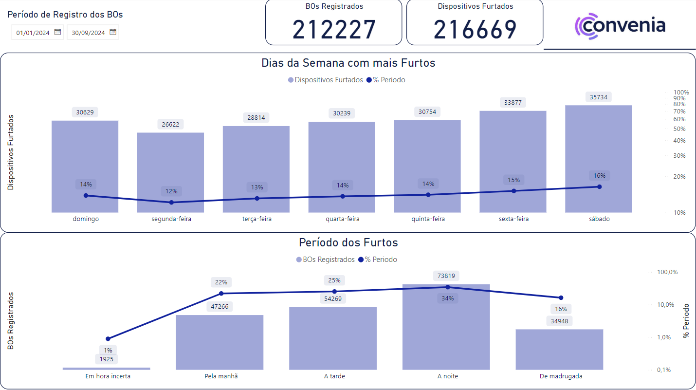

Nesse painel, conseguimos visualizar em qual dia da semana os roubos acontecem em grande quantidade.

Podemos constatar que os roubos são registrados em maior parte no final de semana, entre sexta-feira e domingo.

Esse número elevado se dá por conta do grande número de pessoas que saem aos finais de semana por motivos de lazer.

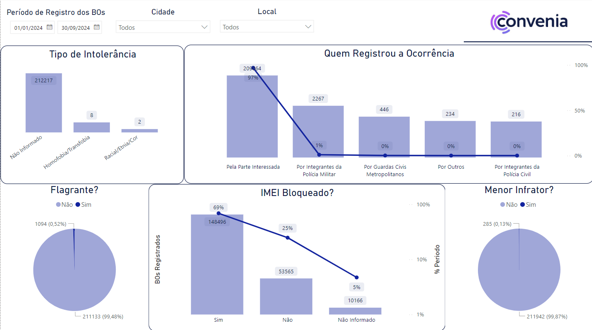

Neste último painel, podemos analisar mais alguns pequenos detalhes sobre os BOs.

Dos BOs registrados, 97% são registrados pela parte interessada, ou seja, a pessoa que foi roubada. Os demais foram divididas entre outras corporações.

Desses BOs, somente 10 tivemos casos de intolerância.

Os painéis de Flagrante e Menor Infrator, podemos concluir que a esmagadora minoria dos BOs tiveram o flagrante, e menos BOs ainda foram registrados por crimes comentido por menores de idade.

De todos os BOs registrados, quase 70% tiveram seu IMEI bloqueado, ou seja, grande parte desses celulares roubados serão inutilizados por quem realizou o roubo.

<br>

# Conclusão
Aqui cheamos ao final do desafio proposto pela Convenia.


<br><br>

## 🚀 Sobre mim
Meu nome é Giovani Duarte, tenho 30 anos, sou Analista de Dados e sou de Belo Horizonte/MG. 

## 🔗 Links
[](https://github.com/djovas)
[](https://www.linkedin.com/in/giovani-duarte-de-souza/)